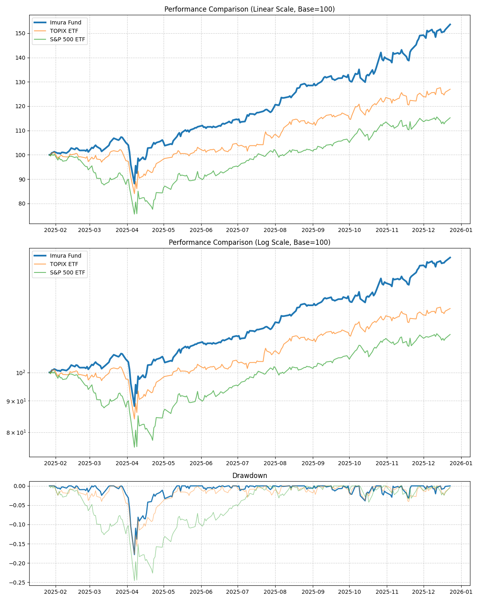

# Imura Fund Analysis Report

**Period:** 2025-01-27 to 2025-12-23 (330 days)

| Asset | Return | CAGR | Volatility | Sharpe | MaxDD |
|---|---|---|---|---|---|
| Imura Fund | 53.59% | 60.79% | 21.27% | 2.86 | -17.82% |
| TOPIX ETF | 26.96% | 30.24% | 21.56% | 1.40 | -17.71% |
| S&P 500 ETF | 15.23% | 16.99% | 27.17% | 0.63 | -24.59% |

