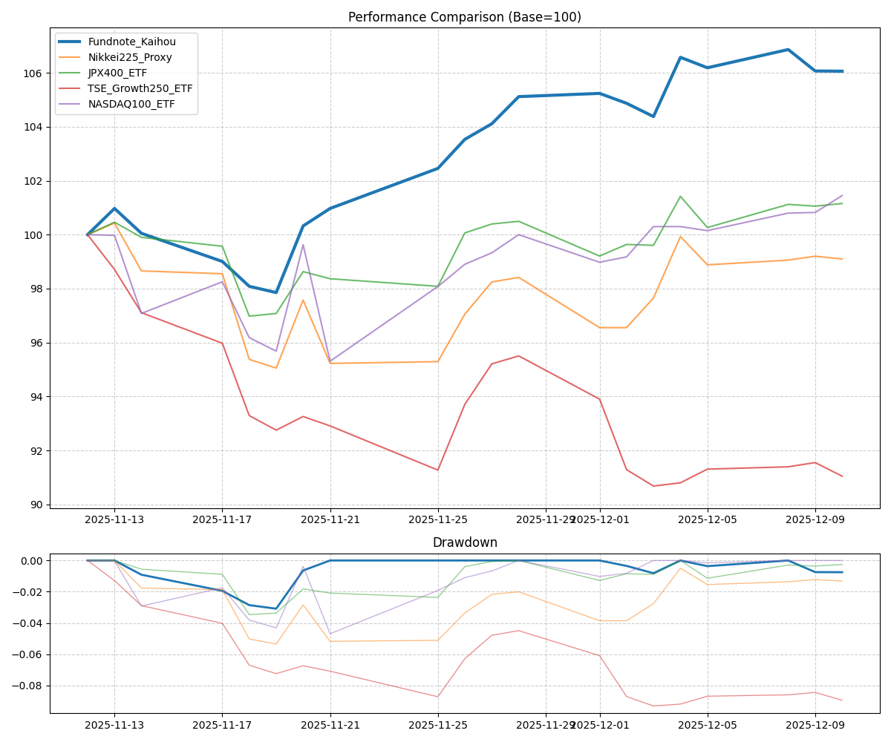

# Imura Fund Analysis Report

**Period:** 2025-11-12 to 2025-12-10 (28 days)

| Asset | Return | CAGR | Volatility | Sharpe | MaxDD |
|---|---|---|---|---|---|
| Fundnote_Kaihou | 6.06% | 115.45% | 16.34% | 7.06 | -3.09% |
| Nikkei225_Proxy | -0.90% | -11.15% | 24.54% | -0.45 | -5.35% |
| JPX400_ETF | 1.16% | 16.17% | 17.32% | 0.93 | -3.47% |
| TSE_Growth250_ETF | -8.95% | -70.59% | 21.94% | -3.22 | -9.32% |
| NASDAQ100_ETF | 1.45% | 20.62% | 29.73% | 0.69 | -4.69% |

