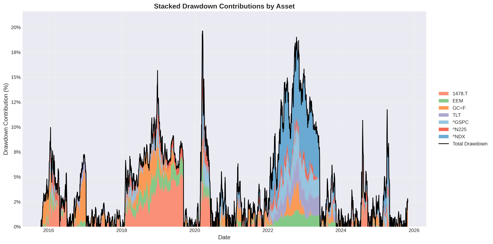
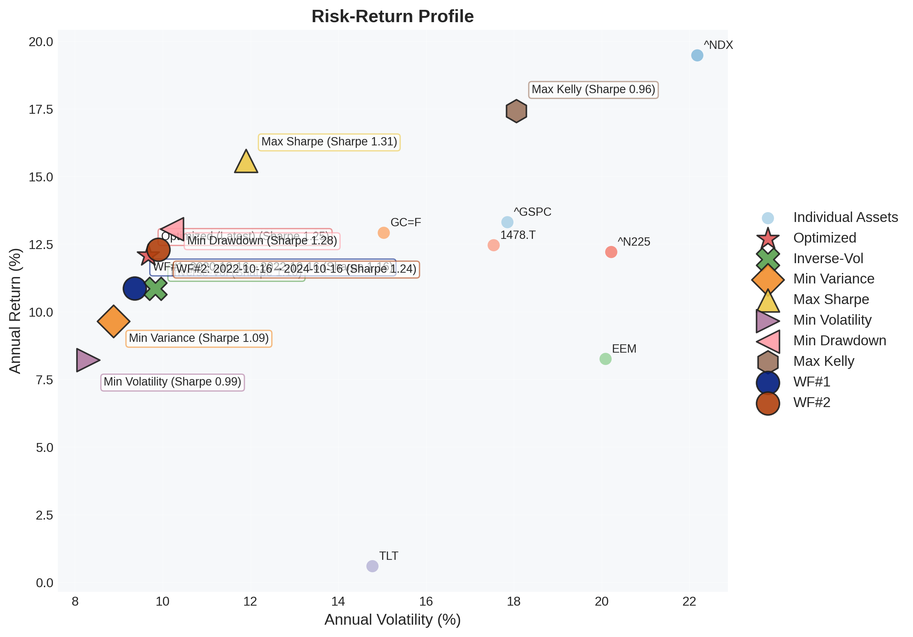
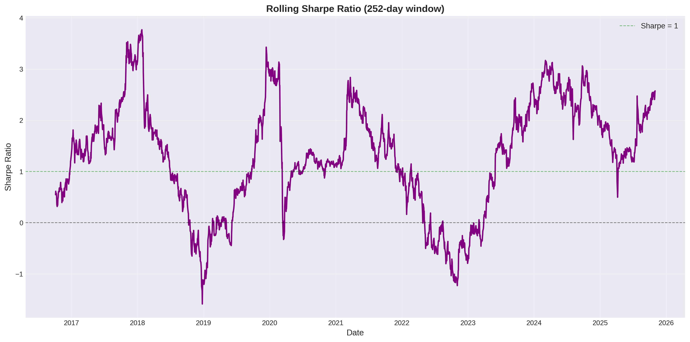
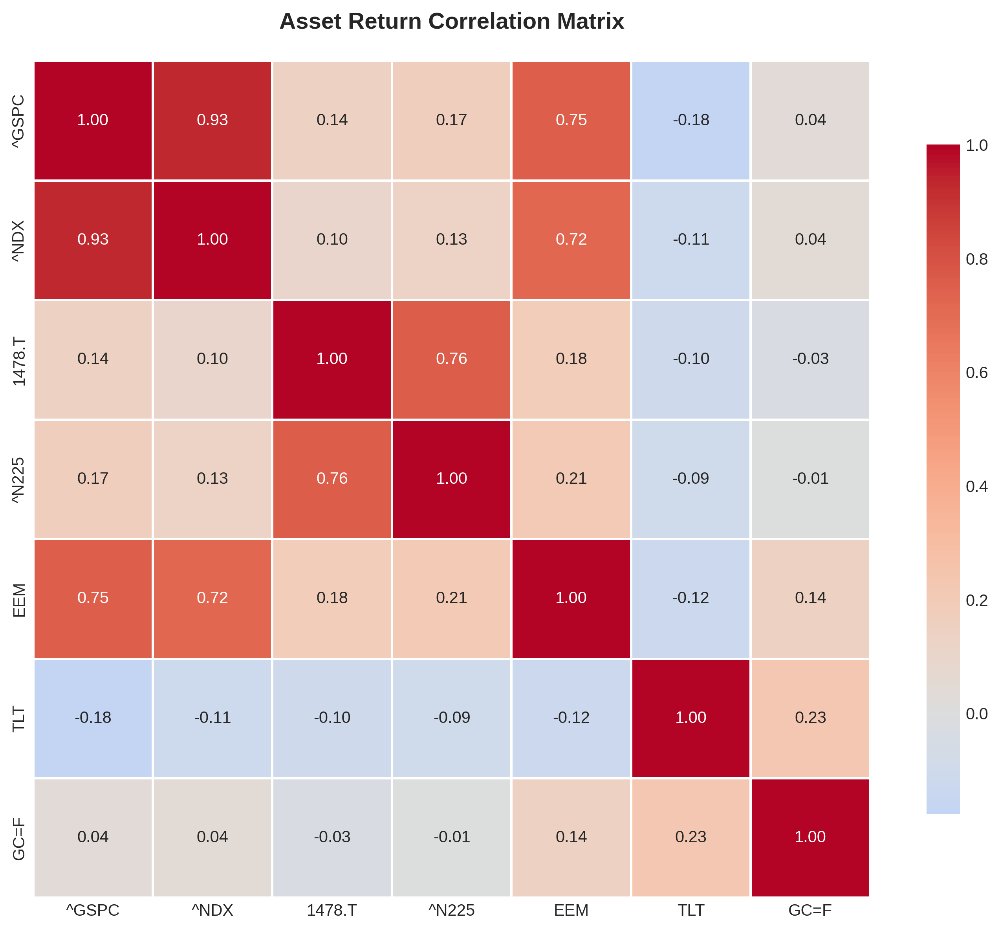

# Index 7-Portfolio Optimization Report

**Generated:** 2025-11-01 09:51:53

## 代替ETF対応表

| 国内ETF | 代替指数 | オリジナル |
|---------|----------|-----------|
| 1655.T ｉＳ米国株 | S&P500指数 | ^GSPC |
| 2840.T ｉＦＥナ百無 | NASDAQ100 | ^NDX |
| 1364.T ｉシェア４百 | JPX日経400 | ^N225 |
| 314A.T ｉＳゴールド | LBMA Gold Price | GC=F |
| 2520.T 野村新興国株 | MSCIエマージング・マーケットIMI指数 | EEM |
| 2511.T 野村外国債券 | FTSE世界国債インデックス(除く日本) | TLT |
| 399A.T 上場高配５０ | 東証配当フォーカス100指数 | 1478.T |

**初期投資額:** ¥20,998,698（Max DD -20.63%バッファ込み、為替リスク排除、円建て運用）

## Portfolio Allocation

| Ticker | Name | Category | Weight |
|--------|------|----------|--------|
| 1655.T | ｉＳ米国株 | equity | 6.48% |
| 2840.T | ｉＦＥナ百無 | equity | 15.89% |
| 1364.T | ｉシェア４百 | equity | 7.67% |
| 314A.T | ｉＳゴールド | commodity | 27.95% |
| 2520.T | 野村新興国株 | equity | 5.87% |
| 2511.T | 野村外国債券 | bonds | 20.64% |
| 399A.T | 上場高配５０ | equity | 15.51% |

## Risk Metrics

- **Portfolio Value:** ¥20,994,611
- **Loan Amount:** ¥10,000,000
- **Current LTV:** 47.63%
- **LTV Limit:** 60%
- **Warning Ratio:** 70%
- **Liquidation Ratio:** 85%

✅ **HEALTHY:** LTV within safe limits

## Visualizations

### Portfolio Allocation

### Cumulative Returns Comparison
Performance of optimized portfolio vs benchmarks over the full period.

### Drawdown Evolution
Historical drawdown profile showing maximum decline periods.

### LTV Stress Tests
Loan-to-Value ratio during historical crisis periods (COVID-19, 2022 Inflation).

### Asset Contribution to Returns
Cumulative contribution of each asset to overall portfolio performance.

### Risk-Return Profile
Scatter plot showing individual asset positions vs optimized portfolio on risk-return spectrum.

### Rolling Sharpe Ratio
252-day rolling Sharpe ratio showing risk-adjusted performance stability over time.

### Asset Correlation Matrix
Correlation heatmap revealing diversification benefits between assets.

