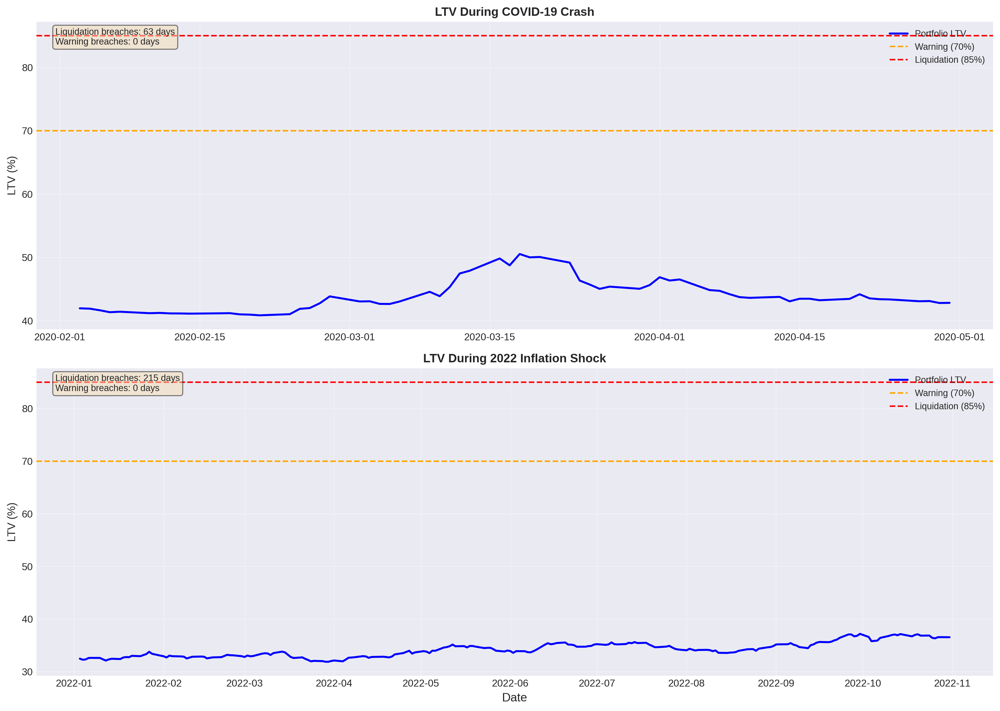

# Index 7-Portfolio Optimization Report

**Generated:** 2025-11-01 12:44:49

## 代替ETF対応表

| 国内ETF | 代替指数 | オリジナル |
|---------|----------|-----------|
| 1655.T ｉＳ米国株 | S&P500指数 | ^GSPC |
| 2840.T ｉＦＥナ百無 | NASDAQ100 | ^NDX |
| 1364.T ｉシェア４百 | JPX日経400 | ^N225 |
| 314A.T ｉＳゴールド | LBMA Gold Price | GC=F |
| 2520.T 野村新興国株 | MSCIエマージング・マーケットIMI指数 | EEM |
| 2511.T 野村外国債券 | FTSE世界国債インデックス(除く日本) | TLT |
| 399A.T 上場高配５０ | 東証配当フォーカス100指数 | 1478.T |

**初期投資額:** ¥20,998,698（Max DD -20.63%バッファ込み、為替リスク排除、円建て運用）

## Portfolio Allocation

| Ticker | Name | Category | Weight |
|--------|------|----------|--------|
| ^GSPC | S&P 500 Index | equity | 12.77% |
| ^NDX | NASDAQ-100 Index | equity | 15.33% |
| ^N225 | Nikkei 225 Index | equity | 7.25% |
| GC=F | Gold Futures (COMEX) | commodity | 26.24% |
| EEM | iShares MSCI Emerging Markets ETF | equity | 7.24% |
| TLT | iShares 20+ Year Treasury Bond ETF | bonds | 10.79% |
| 1478.T | iShares MSCI Japan High Dividend ETF | equity | 20.39% |

## Risk Metrics

- **Portfolio Value:** ¥20,973,753
- **Loan Amount:** ¥10,000,000
- **Current LTV:** 47.68%
- **LTV Limit:** 60%
- **Warning Ratio:** 70%
- **Liquidation Ratio:** 85%

✅ **HEALTHY:** LTV within safe limits

## トレーニング設定と検証概要

- **最適化サンプル数:** 10,000
- **最適化目的関数ウェイト:** sharpe 60%, volatility 40%
- **制約条件:** min_weight=0.05, max_weight=0.30, max_volatility=0.15
- **リバランス頻度（検証時）:** 四半期（Q）
- **訓練期間 / テスト期間:** 5年 / 2年（ローリング）
- **最適化ルックバック:** 10y
- **最大ドローダウンバッファ:** 20.63%

### ウォークフォワード検証サマリー

- **評価期間数:** 2
- **平均アウトオブサンプル Sharpe:** 1.098 ± 1.378
- **平均年率リターン:** 10.01%
- **平均最大ドローダウン:** -14.67%
- **Stability Score:** 0.420

### 期間別ポートフォリオ構成（降順ウェイト）

| Period | 訓練期間 | テスト期間 | ウェイト構成 | Sharpe | Max DD |
|--------|-----------|------------|--------------|--------|--------|
| 1 | 2015-10-16〜2020-10-16 | 2020-10-16〜2022-10-16 | ^NDX 26.6% TLT 22.5% GC=F 16.2% 1478.T 16.0% ^N225 8.1% ^GSPC 5.4% EEM 5.2% | -0.280 | -20.70% |
| 2 | 2015-10-16〜2022-10-16 | 2022-10-16〜2024-10-16 | GC=F 28.8% ^GSPC 13.9% 1478.T 13.7% TLT 13.7% ^N225 12.9% ^NDX 12.0% EEM 5.0% | 2.476 | -8.63% |

## Visualizations

### Portfolio Allocation
100% stacked bar chart comparing asset weights across the optimized portfolio, reference strategies (Equal Weight, 60/40 Mix, Inverse-Vol, Min/Max variants), and walk-forward periods.

### Cumulative Returns Comparison
Stacked area view of strategy share (Optimized, Equal Weight, reference mixes) with cumulative return overlay.

### Drawdown Evolution
Stacked drawdown contributions by asset category, with total drawdown overlay.

### LTV Stress Tests
Loan-to-Value ratio during historical crisis periods (COVID-19, 2022 Inflation).

### Asset Contribution to Returns
Cumulative contribution of each asset to overall portfolio performance.

### Risk-Return Profile
Scatter plot comparing individual assets with multiple allocation strategies (Optimized, Equal Weight, 60/40 Mix, Inverse-Vol, Min Variance, Max Sharpe, Min Volatility, Min Drawdown, Max Kelly, Walk-Forward portfolios WF#1/WF#2).

### Rolling Sharpe Ratio
252-day rolling Sharpe ratio showing risk-adjusted performance stability over time.

### Asset Correlation Matrix
Correlation heatmap revealing diversification benefits between assets.

