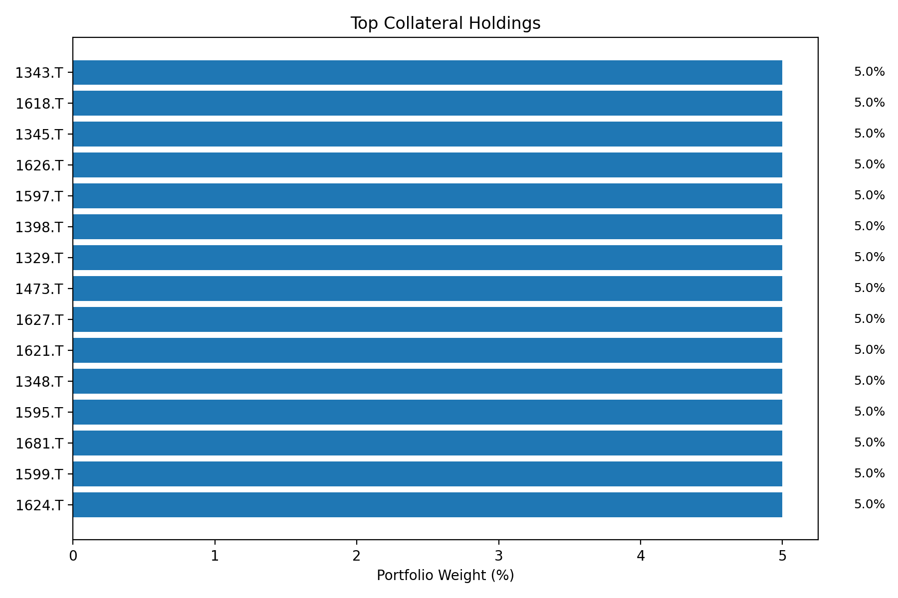
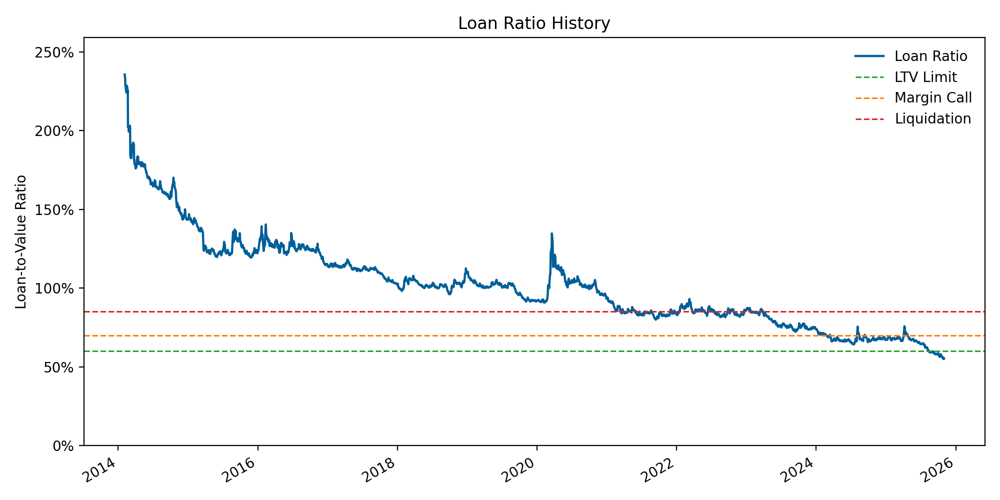
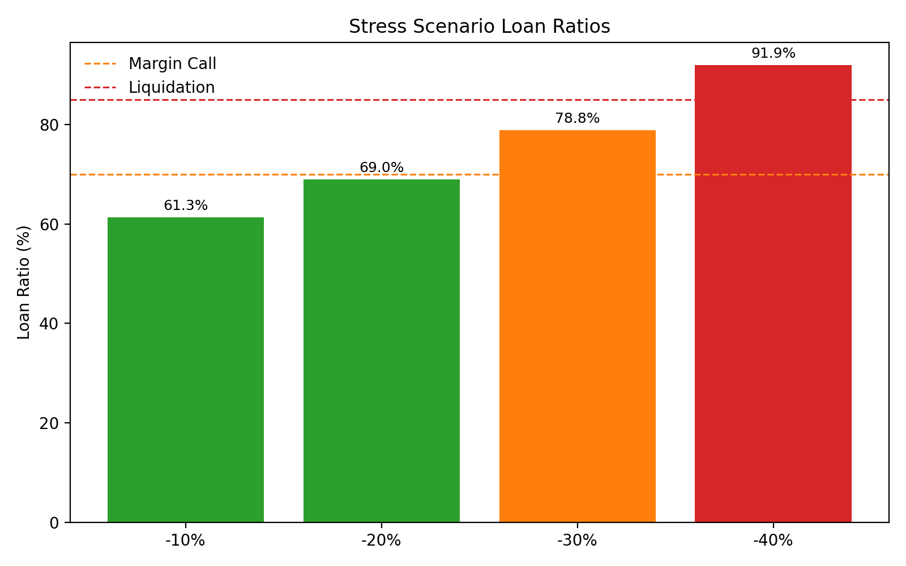
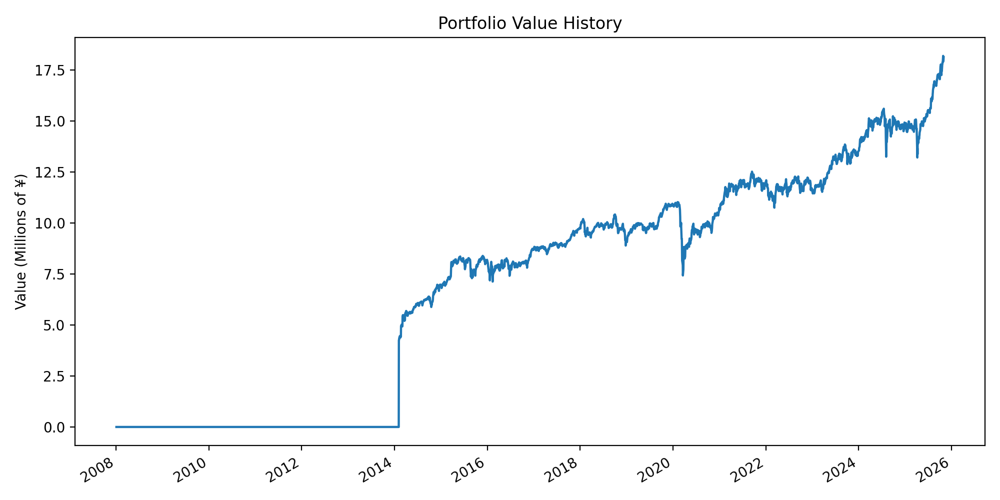
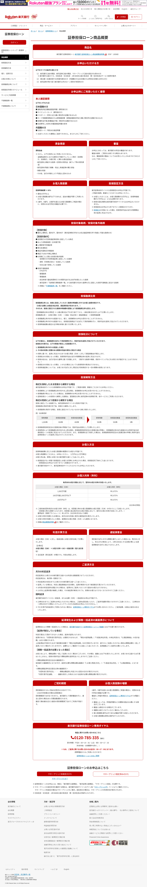

# Securities Collateral Loan Risk Report

*Generated via automated portfolio optimization*

## Overview
- Loan amount: ¥10,000,000.0
- Annual interest rate: 1.875%
- Collateral period evaluated: 3y
- Current collateral market value: ¥18127076
- Current loan ratio: 0.552
- Max allowable borrowing ratio (Rakuten Securities): 0.60
- Margin call (補充) threshold: 0.70
- Forced liquidation threshold: 0.85
- Buffer to margin call: 21.19% drop from current value
- Buffer to forced liquidation: 35.10% drop from current value
- Historical max drawdown (portfolio): -32.63%

## Visual Highlights
Key diagnostics generated from the latest prices and risk thresholds.

### Collateral Allocation Mix
Relative weights for the top holdings in the optimized portfolio.

### Loan Ratio vs Thresholds
Historical loan-to-value trajectory with Rakuten Securities' warning and liquidation lines.

### Stress Scenario Outcomes
Loan ratio impact under the configured -10% to -40% price shocks.

### Portfolio Value Path
Mark-to-market collateral value expressed in millions of yen.

## Official Reference
Latest Rakuten Bank securities-collateral loan terms page captured on 2025-11-11 (JST).

## Optimization Summary
- Total ETFs evaluated: 71
- ETFs with sufficient data: 59
- Candidate universe after correlation filter: 48 (threshold 0.90)
- Excluded ETFs: 2 hedged, 0 high-volatility, 10 deep-drawdown
- Selected profile: max_sharpe

### Portfolio Variants
| Variant | Optimization Strategy | Annual Return | Annual Volatility | Sharpe | Kelly (r/σ²) |
| --- | --- | --- | --- | --- | --- |
| Max Sharpe Portfolio | max_sharpe | 11.86% | 13.35% | 0.888 | 6.655 |
| Minimum-Variance Portfolio | min_variance | 11.86% | 13.35% | 0.888 | 6.655 |
| Max Kelly Criterion Portfolio | max_kelly | 11.86% | 13.35% | 0.888 | 6.655 |

**Max Sharpe Portfolio Holdings (max_sharpe)**
| Ticker | Weight | Weight (Realized) | Quantity | Price | Name |
| --- | --- | --- | --- | --- | --- |
| 1621.T | 5.00% | 5.01% | 34 | ¥26,705 | ＮＥＸＴ　ＦＵＮＤＳ　医薬品（ＴＯＰＩＸ－１７）上場投信 |
| 1627.T | 5.00% | 5.02% | 85 | ¥10,710 | ＮＥＸＴ　ＦＵＮＤＳ　電力・ガス（ＴＯＰＩＸ－１７）上場投信 |
| 1628.T | 5.00% | 5.04% | 45 | ¥20,295 | ＮＥＸＴ　ＦＵＮＤＳ　運輸・物流（ＴＯＰＩＸ－１７）上場投信 |
| 1586.T | 5.00% | 5.04% | 345 | ¥2,650 | 上場インデックスファンドＴＯＰＩＸ　Ｅｘ－Ｆｉｎａｎｃｉａｌｓ |
| 1625.T | 5.00% | 4.96% | 18 | ¥49,950 | ＮＥＸＴ　ＦＵＮＤＳ　電機・精密（ＴＯＰＩＸ－１７）上場投信 |
| 1480.T | 5.00% | 4.93% | 28 | ¥31,930 | ＮＥＸＴ　ＦＵＮＤＳ　野村企業価値分配指数連動型上場投信 |
| 1620.T | 5.00% | 4.99% | 30 | ¥30,160 | ＮＥＸＴ　ＦＵＮＤＳ　素材・化学（ＴＯＰＩＸ－１７）上場投信 |
| 1624.T | 5.00% | 4.64% | 11 | ¥76,480 | ＮＥＸＴ　ＦＵＮＤＳ　機械（ＴＯＰＩＸ－１７）上場投信 |
| 1599.T | 5.00% | 4.93% | 29 | ¥30,800 | ｉＦｒｅｅＥＴＦ　ＪＰＸ日経４００ |
| 1595.T | 5.00% | 5.05% | 454 | ¥2,016 | ＮＺＡＭ　上場投信　東証ＲＥＩＴ指数　　　　　　　　　　　　 |
| 1681.T | 5.00% | 5.05% | 335 | ¥2,735 | 上場インデックスファンド海外新興国株式（ＭＳＣＩエマージング） |
| 1473.T | 5.00% | 5.04% | 268 | ¥3,409 | Ｏｎｅ　ＥＴＦ　トピックス |
| 1329.T | 5.00% | 5.03% | 168 | ¥5,428 | ｉシェアーズ・コア　日経２２５　ＥＴＦ |
| 1398.T | 5.00% | 5.05% | 451 | ¥2,030 | ＳＭＤＡＭ　東証ＲＥＩＴ指数上場投信 |
| 1597.T | 5.00% | 5.05% | 450 | ¥2,036 | ＭＡＸＩＳ　Ｊリート上場投信 |
| 1348.T | 5.00% | 5.04% | 263 | ¥3,473 | ＭＡＸＩＳ　トピックス上場投信 |
| 1343.T | 5.00% | 5.05% | 426 | ¥2,147 | ＮＥＸＴ　ＦＵＮＤＳ　東証ＲＥＩＴ指数連動型上場投信 |
| 1618.T | 5.00% | 5.02% | 35 | ¥25,975 | ＮＥＸＴ　ＦＵＮＤＳ　エネルギー資源（ＴＯＰＩＸ－１７）上場投信 |
| 1345.T | 5.00% | 5.05% | 456 | ¥2,009 | 上場インデックスファンドＪリート（東証ＲＥＩＴ指数）隔月分配型 |
| 1626.T | 5.00% | 5.00% | 20 | ¥45,330 | ＮＥＸＴ　ＦＵＮＤＳ　情報通信・サービスその他（ＴＯＰＩＸ－１７）上場投信 |

**Minimum-Variance Portfolio Holdings (min_variance)**
| Ticker | Weight | Weight (Realized) | Quantity | Price | Name |
| --- | --- | --- | --- | --- | --- |
| 1621.T | 5.00% | 5.01% | 34 | ¥26,705 | ＮＥＸＴ　ＦＵＮＤＳ　医薬品（ＴＯＰＩＸ－１７）上場投信 |
| 1627.T | 5.00% | 5.02% | 85 | ¥10,710 | ＮＥＸＴ　ＦＵＮＤＳ　電力・ガス（ＴＯＰＩＸ－１７）上場投信 |
| 1628.T | 5.00% | 5.04% | 45 | ¥20,295 | ＮＥＸＴ　ＦＵＮＤＳ　運輸・物流（ＴＯＰＩＸ－１７）上場投信 |
| 1586.T | 5.00% | 5.04% | 345 | ¥2,650 | 上場インデックスファンドＴＯＰＩＸ　Ｅｘ－Ｆｉｎａｎｃｉａｌｓ |
| 1625.T | 5.00% | 4.96% | 18 | ¥49,950 | ＮＥＸＴ　ＦＵＮＤＳ　電機・精密（ＴＯＰＩＸ－１７）上場投信 |
| 1480.T | 5.00% | 4.93% | 28 | ¥31,930 | ＮＥＸＴ　ＦＵＮＤＳ　野村企業価値分配指数連動型上場投信 |
| 1620.T | 5.00% | 4.99% | 30 | ¥30,160 | ＮＥＸＴ　ＦＵＮＤＳ　素材・化学（ＴＯＰＩＸ－１７）上場投信 |
| 1624.T | 5.00% | 4.64% | 11 | ¥76,480 | ＮＥＸＴ　ＦＵＮＤＳ　機械（ＴＯＰＩＸ－１７）上場投信 |
| 1599.T | 5.00% | 4.93% | 29 | ¥30,800 | ｉＦｒｅｅＥＴＦ　ＪＰＸ日経４００ |
| 1595.T | 5.00% | 5.05% | 454 | ¥2,016 | ＮＺＡＭ　上場投信　東証ＲＥＩＴ指数　　　　　　　　　　　　 |
| 1681.T | 5.00% | 5.05% | 335 | ¥2,735 | 上場インデックスファンド海外新興国株式（ＭＳＣＩエマージング） |
| 1473.T | 5.00% | 5.04% | 268 | ¥3,409 | Ｏｎｅ　ＥＴＦ　トピックス |
| 1329.T | 5.00% | 5.03% | 168 | ¥5,428 | ｉシェアーズ・コア　日経２２５　ＥＴＦ |
| 1398.T | 5.00% | 5.05% | 451 | ¥2,030 | ＳＭＤＡＭ　東証ＲＥＩＴ指数上場投信 |
| 1597.T | 5.00% | 5.05% | 450 | ¥2,036 | ＭＡＸＩＳ　Ｊリート上場投信 |
| 1348.T | 5.00% | 5.04% | 263 | ¥3,473 | ＭＡＸＩＳ　トピックス上場投信 |
| 1343.T | 5.00% | 5.05% | 426 | ¥2,147 | ＮＥＸＴ　ＦＵＮＤＳ　東証ＲＥＩＴ指数連動型上場投信 |
| 1618.T | 5.00% | 5.02% | 35 | ¥25,975 | ＮＥＸＴ　ＦＵＮＤＳ　エネルギー資源（ＴＯＰＩＸ－１７）上場投信 |
| 1345.T | 5.00% | 5.05% | 456 | ¥2,009 | 上場インデックスファンドＪリート（東証ＲＥＩＴ指数）隔月分配型 |
| 1626.T | 5.00% | 5.00% | 20 | ¥45,330 | ＮＥＸＴ　ＦＵＮＤＳ　情報通信・サービスその他（ＴＯＰＩＸ－１７）上場投信 |

**Max Kelly Criterion Portfolio Holdings (max_kelly)**
| Ticker | Weight | Weight (Realized) | Quantity | Price | Name |
| --- | --- | --- | --- | --- | --- |
| 1621.T | 5.00% | 5.01% | 34 | ¥26,705 | ＮＥＸＴ　ＦＵＮＤＳ　医薬品（ＴＯＰＩＸ－１７）上場投信 |
| 1627.T | 5.00% | 5.02% | 85 | ¥10,710 | ＮＥＸＴ　ＦＵＮＤＳ　電力・ガス（ＴＯＰＩＸ－１７）上場投信 |
| 1628.T | 5.00% | 5.04% | 45 | ¥20,295 | ＮＥＸＴ　ＦＵＮＤＳ　運輸・物流（ＴＯＰＩＸ－１７）上場投信 |
| 1586.T | 5.00% | 5.04% | 345 | ¥2,650 | 上場インデックスファンドＴＯＰＩＸ　Ｅｘ－Ｆｉｎａｎｃｉａｌｓ |
| 1625.T | 5.00% | 4.96% | 18 | ¥49,950 | ＮＥＸＴ　ＦＵＮＤＳ　電機・精密（ＴＯＰＩＸ－１７）上場投信 |
| 1480.T | 5.00% | 4.93% | 28 | ¥31,930 | ＮＥＸＴ　ＦＵＮＤＳ　野村企業価値分配指数連動型上場投信 |
| 1620.T | 5.00% | 4.99% | 30 | ¥30,160 | ＮＥＸＴ　ＦＵＮＤＳ　素材・化学（ＴＯＰＩＸ－１７）上場投信 |
| 1624.T | 5.00% | 4.64% | 11 | ¥76,480 | ＮＥＸＴ　ＦＵＮＤＳ　機械（ＴＯＰＩＸ－１７）上場投信 |
| 1599.T | 5.00% | 4.93% | 29 | ¥30,800 | ｉＦｒｅｅＥＴＦ　ＪＰＸ日経４００ |
| 1595.T | 5.00% | 5.05% | 454 | ¥2,016 | ＮＺＡＭ　上場投信　東証ＲＥＩＴ指数　　　　　　　　　　　　 |
| 1681.T | 5.00% | 5.05% | 335 | ¥2,735 | 上場インデックスファンド海外新興国株式（ＭＳＣＩエマージング） |
| 1473.T | 5.00% | 5.04% | 268 | ¥3,409 | Ｏｎｅ　ＥＴＦ　トピックス |
| 1329.T | 5.00% | 5.03% | 168 | ¥5,428 | ｉシェアーズ・コア　日経２２５　ＥＴＦ |
| 1398.T | 5.00% | 5.05% | 451 | ¥2,030 | ＳＭＤＡＭ　東証ＲＥＩＴ指数上場投信 |
| 1597.T | 5.00% | 5.05% | 450 | ¥2,036 | ＭＡＸＩＳ　Ｊリート上場投信 |
| 1348.T | 5.00% | 5.04% | 263 | ¥3,473 | ＭＡＸＩＳ　トピックス上場投信 |
| 1343.T | 5.00% | 5.05% | 426 | ¥2,147 | ＮＥＸＴ　ＦＵＮＤＳ　東証ＲＥＩＴ指数連動型上場投信 |
| 1618.T | 5.00% | 5.02% | 35 | ¥25,975 | ＮＥＸＴ　ＦＵＮＤＳ　エネルギー資源（ＴＯＰＩＸ－１７）上場投信 |
| 1345.T | 5.00% | 5.05% | 456 | ¥2,009 | 上場インデックスファンドＪリート（東証ＲＥＩＴ指数）隔月分配型 |
| 1626.T | 5.00% | 5.00% | 20 | ¥45,330 | ＮＥＸＴ　ＦＵＮＤＳ　情報通信・サービスその他（ＴＯＰＩＸ－１７）上場投信 |

### Filter Diagnostics
- Applied Asset Filters: max drawdown ≥ -30.0%

**Removed for currency hedging**
| Ticker | Name |
| --- | --- |
| 1482.T | ｉシェアーズ・コア　米国債７－１０年　ＥＴＦ（為替ヘッジあり） |
| 1487.T | 上場インデックスファンド米国債券（為替ヘッジあり） |

**Removed for deep drawdown**
| Ticker | Name |
| --- | --- |
| 1699.T | ＮＥＸＴ　ＦＵＮＤＳ　ＮＯＭＵＲＡ原油インデックス連動型上場投信 |
| 1632.T | ＮＥＸＴ　ＦＵＮＤＳ　金融（除く銀行）（ＴＯＰＩＸ－１７）上場投信 |
| 1622.T | ＮＥＸＴ　ＦＵＮＤＳ　自動車・輸送機（ＴＯＰＩＸ－１７）上場投信 |
| 1629.T | ＮＥＸＴ　ＦＵＮＤＳ　商社・卸売（ＴＯＰＩＸ－１７）上場投信 |
| 1633.T | ＮＥＸＴ　ＦＵＮＤＳ　不動産（ＴＯＰＩＸ－１７）上場投信 |
| 1364.T | ｉシェアーズ　ＪＰＸ日経４００　ＥＴＦ |
| 1475.T | ｉシェアーズ・コア　ＴＯＰＩＸ　ＥＴＦ |
| 1485.T | ＭＡＸＩＳ　ＪＡＰＡＮ　設備・人材積極投資企業２００上場投信 |
| 1671.T | ＷＴＩ原油価格連動型上場投信 |
| 2568.T | 上場インデックスファンド米国株式（ＮＡＳＤＡＱ１００）為替ヘッジなし |

## Part 1: BACKTEST PERIOD ANALYSIS

**Purpose**: Portfolio construction and constraint validation
**Period**: 2008-01-04 to 2025-10-31 (17.8 years)
**Important**: These metrics are based on **historical data** used for optimization.
They do NOT guarantee future performance.

### Backtest Period Metrics
| Metric | Value | Constraint | Status |
| --- | --- | --- | --- |
| Annual Return | 11.86% | - | - |
| Annual Volatility | 13.35% | ≤ 12% | ❌ |
| Sharpe Ratio | 0.888 | - | - |
| Weighted Expense Ratio | 0.23% | < 0.40% | ✅ |

### Profile Metrics
| Profile | Annual Return | Volatility | Sharpe | Expense Ratio | Selected |
| --- | --- | --- | --- | --- | --- |
| max_sharpe | 11.86% | 13.35% | 0.888 | 0.23% | Yes |
| low_volatility | 11.86% | 13.35% | 0.888 | 0.23% |  |
| cost_focus | 12.01% | 13.99% | 0.859 | 0.27% |  |

### Top 10 ETFs by Composite Score
| Rank | Ticker | Name | Return | Volatility | Sharpe | Expense | Score |
| --- | --- | --- | --- | --- | --- | --- | --- |
| 1 | 1621.T | ＮＥＸＴ　ＦＵＮＤＳ　医薬品（ＴＯＰＩＸ－１７）上場投信 | 5.03% | 19.63% | 0.256 | 0.32% | 0.783 |
| 2 | 1627.T | ＮＥＸＴ　ＦＵＮＤＳ　電力・ガス（ＴＯＰＩＸ－１７）上場投信 | 15.84% | 22.49% | 0.704 | 0.32% | 0.769 |
| 3 | 1628.T | ＮＥＸＴ　ＦＵＮＤＳ　運輸・物流（ＴＯＰＩＸ－１７）上場投信 | 11.83% | 20.19% | 0.586 | 0.32% | 0.766 |
| 4 | 1586.T | 上場インデックスファンドＴＯＰＩＸ　Ｅｘ－Ｆｉｎａｎｃｉａｌ | 17.73% | 21.85% | 0.812 | 0.09% | 0.724 |
| 5 | 1625.T | ＮＥＸＴ　ＦＵＮＤＳ　電機・精密（ＴＯＰＩＸ－１７）上場投信 | 20.84% | 24.81% | 0.840 | 0.32% | 0.715 |
| 6 | 1480.T | ＮＥＸＴ　ＦＵＮＤＳ　野村企業価値分配指数連動型上場投信 | 17.95% | 21.79% | 0.824 | 0.23% | 0.710 |
| 7 | 1620.T | ＮＥＸＴ　ＦＵＮＤＳ　素材・化学（ＴＯＰＩＸ－１７）上場投信 | 8.55% | 18.48% | 0.463 | 0.32% | 0.704 |
| 8 | 1624.T | ＮＥＸＴ　ＦＵＮＤＳ　機械（ＴＯＰＩＸ－１７）上場投信 | 21.68% | 24.71% | 0.878 | 0.32% | 0.685 |
| 9 | 1599.T | ｉＦｒｅｅＥＴＦ　ＪＰＸ日経４００ | 19.05% | 22.06% | 0.863 | 0.18% | 0.679 |
| 10 | 1595.T | ＮＺＡＭ　上場投信　東証ＲＥＩＴ指数　　　　　　　　　　　　 | 7.66% | 13.16% | 0.582 | 0.25% | 0.606 |

## Part 2: PORTFOLIO CONSTRUCTION

**Purpose**: Selected ETFs and portfolio composition at anchor date

### Collateral Breakdown
### By Category
| Category | ETF Count | Market Value | Weight |
| --- | --- | --- | --- |
| 国内セクター | 8 | ¥7,192,500 | 39.7% |
| 国内株式 | 5 | ¥4,550,746 | 25.1% |
| その他 | 4 | ¥3,635,301 | 20.1% |
| REIT | 2 | ¥1,832,304 | 10.1% |
| 海外株式 | 1 | ¥916,225 | 5.1% |

### Top Holdings (out of 20 ETFs)
| Ticker | Name | Quantity | Price | Market Value | Weight | Expense | Return | Volatility | Sharpe |
| --- | --- | --- | --- | --- | --- | --- | --- | --- | --- |
| 1681.T | 上場インデックスファンド海外新興国株式（ＭＳＣＩエマージング） | 335 | ¥2735.00 | ¥916225 | 5.1% | 0.24% | 16.27% | 19.60% | 0.830 |
| 1597.T | ＭＡＸＩＳ　Ｊリート上場投信 | 450 | ¥2036.00 | ¥916200 | 5.1% | 0.14% | 7.64% | 12.98% | 0.589 |
| 1345.T | 上場インデックスファンドＪリート（東証ＲＥＩＴ指数）隔月分配型 | 456 | ¥2009.00 | ¥916104 | 5.1% | 0.30% | 7.54% | 12.57% | 0.600 |
| 1398.T | ＳＭＤＡＭ　東証ＲＥＩＴ指数上場投信 | 451 | ¥2030.50 | ¥915756 | 5.1% | 0.22% | 7.62% | 12.99% | 0.587 |
| 1595.T | ＮＺＡＭ　上場投信　東証ＲＥＩＴ指数　　　　　　　　　　　　 | 454 | ¥2016.00 | ¥915264 | 5.0% | 0.25% | 7.66% | 13.16% | 0.582 |
| 1343.T | ＮＥＸＴ　ＦＵＮＤＳ　東証ＲＥＩＴ指数連動型上場投信 | 426 | ¥2147.00 | ¥914622 | 5.0% | 0.15% | 7.58% | 12.77% | 0.594 |
| 1586.T | 上場インデックスファンドＴＯＰＩＸ　Ｅｘ－Ｆｉｎａｎｃｉａｌｓ | 345 | ¥2650.00 | ¥914250 | 5.0% | 0.09% | 17.73% | 21.85% | 0.812 |
| 1473.T | Ｏｎｅ　ＥＴＦ　トピックス | 268 | ¥3409.00 | ¥913612 | 5.0% | 0.04% | 19.00% | 20.44% | 0.929 |
| 1348.T | ＭＡＸＩＳ　トピックス上場投信 | 263 | ¥3473.00 | ¥913399 | 5.0% | 0.06% | 18.74% | 20.12% | 0.931 |
| 1628.T | ＮＥＸＴ　ＦＵＮＤＳ　運輸・物流（ＴＯＰＩＸ－１７）上場投信 | 45 | ¥20295.00 | ¥913275 | 5.0% | 0.32% | 11.83% | 20.19% | 0.586 |
| 1329.T | ｉシェアーズ・コア　日経２２５　ＥＴＦ | 168 | ¥5428.00 | ¥911904 | 5.0% | 0.04% | 20.32% | 21.18% | 0.960 |
| 1627.T | ＮＥＸＴ　ＦＵＮＤＳ　電力・ガス（ＴＯＰＩＸ－１７）上場投信 | 85 | ¥10710.00 | ¥910350 | 5.0% | 0.32% | 15.84% | 22.49% | 0.704 |
| 1618.T | ＮＥＸＴ　ＦＵＮＤＳ　エネルギー資源（ＴＯＰＩＸ－１７）上場投信 | 35 | ¥25975.00 | ¥909125 | 5.0% | 0.32% | 30.18% | 28.37% | 1.064 |
| 1621.T | ＮＥＸＴ　ＦＵＮＤＳ　医薬品（ＴＯＰＩＸ－１７）上場投信 | 34 | ¥26705.00 | ¥907970 | 5.0% | 0.32% | 5.03% | 19.63% | 0.256 |
| 1626.T | ＮＥＸＴ　ＦＵＮＤＳ　情報通信・サービスその他（ＴＯＰＩＸ－１７）上場投信 | 20 | ¥45330.00 | ¥906600 | 5.0% | 0.32% | 14.58% | 17.58% | 0.829 |
| 1620.T | ＮＥＸＴ　ＦＵＮＤＳ　素材・化学（ＴＯＰＩＸ－１７）上場投信 | 30 | ¥30160.00 | ¥904800 | 5.0% | 0.32% | 8.55% | 18.48% | 0.463 |
| 1625.T | ＮＥＸＴ　ＦＵＮＤＳ　電機・精密（ＴＯＰＩＸ－１７）上場投信 | 18 | ¥49950.00 | ¥899100 | 5.0% | 0.32% | 20.84% | 24.81% | 0.840 |
| 1480.T | ＮＥＸＴ　ＦＵＮＤＳ　野村企業価値分配指数連動型上場投信 | 28 | ¥31930.00 | ¥894040 | 4.9% | 0.23% | 17.95% | 21.79% | 0.824 |
| 1599.T | ｉＦｒｅｅＥＴＦ　ＪＰＸ日経４００ | 29 | ¥30800.00 | ¥893200 | 4.9% | 0.18% | 19.05% | 22.06% | 0.863 |
| 1624.T | ＮＥＸＴ　ＦＵＮＤＳ　機械（ＴＯＰＩＸ－１７）上場投信 | 11 | ¥76480.00 | ¥841280 | 4.6% | 0.32% | 21.68% | 24.71% | 0.878 |

*Total: 20 ETFs, Portfolio value: ¥18,127,076*

### Annual Performance by ETF
| Year | Ticker | Name | Return | Volatility | Sharpe |
| --- | --- | --- | --- | --- | --- |
| 2014 | 1329.T | ｉシェアーズ・コア　日経２２５　ＥＴＦ | 38.45% | 23.00% | 1.671 |
| 2014 | 1343.T | ＮＥＸＴ　ＦＵＮＤＳ　東証ＲＥＩＴ指数連動型上場投信 | 35.02% | 11.30% | 3.099 |
| 2014 | 1345.T | 上場インデックスファンドＪリート（東証ＲＥＩＴ指数）隔月分配型 | 34.29% | 10.97% | 3.125 |
| 2014 | 1348.T | ＭＡＸＩＳ　トピックス上場投信 | 26.02% | 17.55% | 1.483 |
| 2014 | 1586.T | 上場インデックスファンドＴＯＰＩＸ　Ｅｘ－Ｆｉｎａｎｃｉａｌｓ | 30.77% | 27.17% | 1.133 |
| 2014 | 1595.T | ＮＺＡＭ　上場投信　東証ＲＥＩＴ指数　　　　　　　　　　　　 | 31.82% | 17.15% | 1.855 |
| 2014 | 1597.T | ＭＡＸＩＳ　Ｊリート上場投信 | 30.80% | 11.25% | 2.738 |
| 2014 | 1599.T | ｉＦｒｅｅＥＴＦ　ＪＰＸ日経４００ | 23.70% | 16.58% | 1.430 |
| 2014 | 1618.T | ＮＥＸＴ　ＦＵＮＤＳ　エネルギー資源（ＴＯＰＩＸ－１７）上場投信 | 12.28% | 21.78% | 0.564 |
| 2014 | 1620.T | ＮＥＸＴ　ＦＵＮＤＳ　素材・化学（ＴＯＰＩＸ－１７）上場投信 | 39.44% | 18.13% | 2.176 |
| 2014 | 1621.T | ＮＥＸＴ　ＦＵＮＤＳ　医薬品（ＴＯＰＩＸ－１７）上場投信 | 24.46% | 20.14% | 1.215 |
| 2014 | 1624.T | ＮＥＸＴ　ＦＵＮＤＳ　機械（ＴＯＰＩＸ－１７）上場投信 | 26.29% | 19.94% | 1.318 |
| 2014 | 1625.T | ＮＥＸＴ　ＦＵＮＤＳ　電機・精密（ＴＯＰＩＸ－１７）上場投信 | 33.71% | 22.45% | 1.501 |
| 2014 | 1626.T | ＮＥＸＴ　ＦＵＮＤＳ　情報通信・サービスその他（ＴＯＰＩＸ－１７）上場投信 | 18.57% | 19.36% | 0.959 |
| 2014 | 1627.T | ＮＥＸＴ　ＦＵＮＤＳ　電力・ガス（ＴＯＰＩＸ－１７）上場投信 | 24.86% | 20.30% | 1.225 |
| 2014 | 1628.T | ＮＥＸＴ　ＦＵＮＤＳ　運輸・物流（ＴＯＰＩＸ－１７）上場投信 | 32.88% | 16.86% | 1.950 |
| 2014 | 1681.T | 上場インデックスファンド海外新興国株式（ＭＳＣＩエマージング） | 29.82% | 14.37% | 2.076 |
| 2015 | 1329.T | ｉシェアーズ・コア　日経２２５　ＥＴＦ | 10.62% | 20.25% | 0.524 |
| 2015 | 1343.T | ＮＥＸＴ　ＦＵＮＤＳ　東証ＲＥＩＴ指数連動型上場投信 | -5.38% | 16.95% | -0.317 |
| 2015 | 1345.T | 上場インデックスファンドＪリート（東証ＲＥＩＴ指数）隔月分配型 | -4.91% | 16.76% | -0.293 |
| 2015 | 1348.T | ＭＡＸＩＳ　トピックス上場投信 | 11.87% | 19.85% | 0.598 |
| 2015 | 1398.T | ＳＭＤＡＭ　東証ＲＥＩＴ指数上場投信 | -3.22% | 25.83% | -0.125 |
| 2015 | 1473.T | Ｏｎｅ　ＥＴＦ　トピックス | 5.81% | 22.77% | 0.255 |
| 2015 | 1586.T | 上場インデックスファンドＴＯＰＩＸ　Ｅｘ－Ｆｉｎａｎｃｉａｌｓ | 7.17% | 27.48% | 0.261 |
| 2015 | 1595.T | ＮＺＡＭ　上場投信　東証ＲＥＩＴ指数　　　　　　　　　　　　 | -6.13% | 22.44% | -0.273 |
| 2015 | 1597.T | ＭＡＸＩＳ　Ｊリート上場投信 | -5.28% | 15.48% | -0.341 |
| 2015 | 1599.T | ｉＦｒｅｅＥＴＦ　ＪＰＸ日経４００ | 10.78% | 19.74% | 0.546 |
| 2015 | 1618.T | ＮＥＸＴ　ＦＵＮＤＳ　エネルギー資源（ＴＯＰＩＸ－１７）上場投信 | -0.74% | 28.47% | -0.026 |
| 2015 | 1620.T | ＮＥＸＴ　ＦＵＮＤＳ　素材・化学（ＴＯＰＩＸ－１７）上場投信 | 14.72% | 19.98% | 0.737 |
| 2015 | 1621.T | ＮＥＸＴ　ＦＵＮＤＳ　医薬品（ＴＯＰＩＸ－１７）上場投信 | 33.15% | 22.66% | 1.463 |
| 2015 | 1624.T | ＮＥＸＴ　ＦＵＮＤＳ　機械（ＴＯＰＩＸ－１７）上場投信 | -4.32% | 23.50% | -0.184 |
| 2015 | 1625.T | ＮＥＸＴ　ＦＵＮＤＳ　電機・精密（ＴＯＰＩＸ－１７）上場投信 | 4.24% | 21.75% | 0.195 |
| 2015 | 1626.T | ＮＥＸＴ　ＦＵＮＤＳ　情報通信・サービスその他（ＴＯＰＩＸ－１７）上場投信 | 21.10% | 20.62% | 1.023 |
| 2015 | 1627.T | ＮＥＸＴ　ＦＵＮＤＳ　電力・ガス（ＴＯＰＩＸ－１７）上場投信 | 11.03% | 22.68% | 0.486 |
| 2015 | 1628.T | ＮＥＸＴ　ＦＵＮＤＳ　運輸・物流（ＴＯＰＩＸ－１７）上場投信 | 16.68% | 21.62% | 0.771 |
| 2015 | 1681.T | 上場インデックスファンド海外新興国株式（ＭＳＣＩエマージング） | -16.22% | 18.94% | -0.856 |
| 2016 | 1329.T | ｉシェアーズ・コア　日経２２５　ＥＴＦ | 2.06% | 26.79% | 0.077 |
| 2016 | 1343.T | ＮＥＸＴ　ＦＵＮＤＳ　東証ＲＥＩＴ指数連動型上場投信 | 9.20% | 17.53% | 0.525 |
| 2016 | 1345.T | 上場インデックスファンドＪリート（東証ＲＥＩＴ指数）隔月分配型 | 9.11% | 16.89% | 0.539 |
| 2016 | 1348.T | ＭＡＸＩＳ　トピックス上場投信 | 0.13% | 26.16% | 0.005 |
| 2016 | 1398.T | ＳＭＤＡＭ　東証ＲＥＩＴ指数上場投信 | 9.46% | 24.46% | 0.387 |
| 2016 | 1473.T | Ｏｎｅ　ＥＴＦ　トピックス | 0.16% | 26.85% | 0.006 |
| 2016 | 1480.T | ＮＥＸＴ　ＦＵＮＤＳ　野村企業価値分配指数連動型上場投信 | 11.37% | 19.57% | 0.581 |
| 2016 | 1586.T | 上場インデックスファンドＴＯＰＩＸ　Ｅｘ－Ｆｉｎａｎｃｉａｌｓ | -1.47% | 46.39% | -0.032 |
| 2016 | 1595.T | ＮＺＡＭ　上場投信　東証ＲＥＩＴ指数　　　　　　　　　　　　 | 7.77% | 22.31% | 0.348 |
| 2016 | 1597.T | ＭＡＸＩＳ　Ｊリート上場投信 | 8.89% | 15.33% | 0.580 |
| 2016 | 1599.T | ｉＦｒｅｅＥＴＦ　ＪＰＸ日経４００ | -0.57% | 26.45% | -0.022 |
| 2016 | 1618.T | ＮＥＸＴ　ＦＵＮＤＳ　エネルギー資源（ＴＯＰＩＸ－１７）上場投信 | 4.75% | 35.06% | 0.136 |
| 2016 | 1620.T | ＮＥＸＴ　ＦＵＮＤＳ　素材・化学（ＴＯＰＩＸ－１７）上場投信 | 5.12% | 27.91% | 0.183 |
| 2016 | 1621.T | ＮＥＸＴ　ＦＵＮＤＳ　医薬品（ＴＯＰＩＸ－１７）上場投信 | -8.84% | 25.87% | -0.342 |
| 2016 | 1624.T | ＮＥＸＴ　ＦＵＮＤＳ　機械（ＴＯＰＩＸ－１７）上場投信 | 8.72% | 32.84% | 0.265 |
| 2016 | 1625.T | ＮＥＸＴ　ＦＵＮＤＳ　電機・精密（ＴＯＰＩＸ－１７）上場投信 | 1.94% | 30.98% | 0.063 |
| 2016 | 1626.T | ＮＥＸＴ　ＦＵＮＤＳ　情報通信・サービスその他（ＴＯＰＩＸ－１７）上場投信 | 3.41% | 27.63% | 0.123 |
| 2016 | 1627.T | ＮＥＸＴ　ＦＵＮＤＳ　電力・ガス（ＴＯＰＩＸ－１７）上場投信 | -10.68% | 24.43% | -0.437 |
| 2016 | 1628.T | ＮＥＸＴ　ＦＵＮＤＳ　運輸・物流（ＴＯＰＩＸ－１７）上場投信 | -6.81% | 25.00% | -0.272 |
| 2016 | 1681.T | 上場インデックスファンド海外新興国株式（ＭＳＣＩエマージング） | 3.42% | 23.53% | 0.145 |
| 2017 | 1329.T | ｉシェアーズ・コア　日経２２５　ＥＴＦ | 21.26% | 11.82% | 1.799 |
| 2017 | 1343.T | ＮＥＸＴ　ＦＵＮＤＳ　東証ＲＥＩＴ指数連動型上場投信 | -6.65% | 8.46% | -0.786 |
| 2017 | 1345.T | 上場インデックスファンドＪリート（東証ＲＥＩＴ指数）隔月分配型 | -7.23% | 8.01% | -0.903 |
| 2017 | 1348.T | ＭＡＸＩＳ　トピックス上場投信 | 22.01% | 10.91% | 2.018 |
| 2017 | 1398.T | ＳＭＤＡＭ　東証ＲＥＩＴ指数上場投信 | -6.89% | 16.30% | -0.423 |
| 2017 | 1473.T | Ｏｎｅ　ＥＴＦ　トピックス | 22.35% | 11.06% | 2.020 |
| 2017 | 1480.T | ＮＥＸＴ　ＦＵＮＤＳ　野村企業価値分配指数連動型上場投信 | 23.52% | 11.70% | 2.009 |
| 2017 | 1586.T | 上場インデックスファンドＴＯＰＩＸ　Ｅｘ－Ｆｉｎａｎｃｉａｌｓ | 20.31% | 24.64% | 0.824 |
| 2017 | 1595.T | ＮＺＡＭ　上場投信　東証ＲＥＩＴ指数　　　　　　　　　　　　 | -5.17% | 10.48% | -0.493 |
| 2017 | 1597.T | ＭＡＸＩＳ　Ｊリート上場投信 | -6.32% | 7.87% | -0.803 |
| 2017 | 1599.T | ｉＦｒｅｅＥＴＦ　ＪＰＸ日経４００ | 20.47% | 10.84% | 1.888 |
| 2017 | 1618.T | ＮＥＸＴ　ＦＵＮＤＳ　エネルギー資源（ＴＯＰＩＸ－１７）上場投信 | 43.52% | 20.13% | 2.162 |
| 2017 | 1620.T | ＮＥＸＴ　ＦＵＮＤＳ　素材・化学（ＴＯＰＩＸ－１７）上場投信 | 34.28% | 13.04% | 2.628 |
| 2017 | 1621.T | ＮＥＸＴ　ＦＵＮＤＳ　医薬品（ＴＯＰＩＸ－１７）上場投信 | 14.60% | 10.66% | 1.369 |
| 2017 | 1624.T | ＮＥＸＴ　ＦＵＮＤＳ　機械（ＴＯＰＩＸ－１７）上場投信 | 34.94% | 15.42% | 2.266 |
| 2017 | 1625.T | ＮＥＸＴ　ＦＵＮＤＳ　電機・精密（ＴＯＰＩＸ－１７）上場投信 | 33.48% | 16.26% | 2.059 |
| 2017 | 1626.T | ＮＥＸＴ　ＦＵＮＤＳ　情報通信・サービスその他（ＴＯＰＩＸ－１７）上場投信 | 22.79% | 12.31% | 1.851 |
| 2017 | 1627.T | ＮＥＸＴ　ＦＵＮＤＳ　電力・ガス（ＴＯＰＩＸ－１７）上場投信 | -2.93% | 14.10% | -0.208 |
| 2017 | 1628.T | ＮＥＸＴ　ＦＵＮＤＳ　運輸・物流（ＴＯＰＩＸ－１７）上場投信 | 12.78% | 13.14% | 0.972 |
| 2017 | 1681.T | 上場インデックスファンド海外新興国株式（ＭＳＣＩエマージング） | 25.89% | 13.06% | 1.983 |
| 2018 | 1329.T | ｉシェアーズ・コア　日経２２５　ＥＴＦ | -10.57% | 18.63% | -0.567 |
| 2018 | 1343.T | ＮＥＸＴ　ＦＵＮＤＳ　東証ＲＥＩＴ指数連動型上場投信 | 10.59% | 9.22% | 1.149 |
| 2018 | 1345.T | 上場インデックスファンドＪリート（東証ＲＥＩＴ指数）隔月分配型 | 11.77% | 8.79% | 1.339 |
| 2018 | 1348.T | ＭＡＸＩＳ　トピックス上場投信 | -16.05% | 17.51% | -0.917 |
| 2018 | 1398.T | ＳＭＤＡＭ　東証ＲＥＩＴ指数上場投信 | 10.23% | 8.67% | 1.180 |
| 2018 | 1473.T | Ｏｎｅ　ＥＴＦ　トピックス | -16.40% | 18.04% | -0.909 |
| 2018 | 1480.T | ＮＥＸＴ　ＦＵＮＤＳ　野村企業価値分配指数連動型上場投信 | -20.11% | 17.14% | -1.173 |
| 2018 | 1586.T | 上場インデックスファンドＴＯＰＩＸ　Ｅｘ－Ｆｉｎａｎｃｉａｌｓ | -9.34% | 20.10% | -0.464 |
| 2018 | 1595.T | ＮＺＡＭ　上場投信　東証ＲＥＩＴ指数　　　　　　　　　　　　 | 11.06% | 9.82% | 1.127 |
| 2018 | 1597.T | ＭＡＸＩＳ　Ｊリート上場投信 | 11.23% | 8.68% | 1.294 |
| 2018 | 1599.T | ｉＦｒｅｅＥＴＦ　ＪＰＸ日経４００ | -15.90% | 16.77% | -0.948 |
| 2018 | 1618.T | ＮＥＸＴ　ＦＵＮＤＳ　エネルギー資源（ＴＯＰＩＸ－１７）上場投信 | -22.98% | 29.81% | -0.771 |
| 2018 | 1620.T | ＮＥＸＴ　ＦＵＮＤＳ　素材・化学（ＴＯＰＩＸ－１７）上場投信 | -15.41% | 21.99% | -0.701 |
| 2018 | 1621.T | ＮＥＸＴ　ＦＵＮＤＳ　医薬品（ＴＯＰＩＸ－１７）上場投信 | -5.98% | 20.59% | -0.290 |
| 2018 | 1624.T | ＮＥＸＴ　ＦＵＮＤＳ　機械（ＴＯＰＩＸ－１７）上場投信 | -27.82% | 25.37% | -1.097 |
| 2018 | 1625.T | ＮＥＸＴ　ＦＵＮＤＳ　電機・精密（ＴＯＰＩＸ－１７）上場投信 | -21.11% | 21.24% | -0.994 |
| 2018 | 1626.T | ＮＥＸＴ　ＦＵＮＤＳ　情報通信・サービスその他（ＴＯＰＩＸ－１７）上場投信 | -12.25% | 20.25% | -0.605 |
| 2018 | 1627.T | ＮＥＸＴ　ＦＵＮＤＳ　電力・ガス（ＴＯＰＩＸ－１７）上場投信 | 12.90% | 18.98% | 0.680 |
| 2018 | 1628.T | ＮＥＸＴ　ＦＵＮＤＳ　運輸・物流（ＴＯＰＩＸ－１７）上場投信 | -9.33% | 19.07% | -0.489 |
| 2018 | 1681.T | 上場インデックスファンド海外新興国株式（ＭＳＣＩエマージング） | -18.56% | 18.10% | -1.025 |
| 2019 | 1329.T | ｉシェアーズ・コア　日経２２５　ＥＴＦ | 20.90% | 14.32% | 1.460 |
| 2019 | 1343.T | ＮＥＸＴ　ＦＵＮＤＳ　東証ＲＥＩＴ指数連動型上場投信 | 25.34% | 9.61% | 2.637 |
| 2019 | 1345.T | 上場インデックスファンドＪリート（東証ＲＥＩＴ指数）隔月分配型 | 24.93% | 9.49% | 2.628 |
| 2019 | 1348.T | ＭＡＸＩＳ　トピックス上場投信 | 17.89% | 13.15% | 1.361 |
| 2019 | 1398.T | ＳＭＤＡＭ　東証ＲＥＩＴ指数上場投信 | 26.04% | 9.55% | 2.727 |
| 2019 | 1473.T | Ｏｎｅ　ＥＴＦ　トピックス | 18.24% | 13.43% | 1.358 |
| 2019 | 1480.T | ＮＥＸＴ　ＦＵＮＤＳ　野村企業価値分配指数連動型上場投信 | 26.60% | 14.34% | 1.855 |
| 2019 | 1586.T | 上場インデックスファンドＴＯＰＩＸ　Ｅｘ－Ｆｉｎａｎｃｉａｌｓ | 17.85% | 13.17% | 1.356 |
| 2019 | 1595.T | ＮＺＡＭ　上場投信　東証ＲＥＩＴ指数　　　　　　　　　　　　 | 25.02% | 9.47% | 2.643 |
| 2019 | 1597.T | ＭＡＸＩＳ　Ｊリート上場投信 | 25.03% | 9.51% | 2.631 |
| 2019 | 1599.T | ｉＦｒｅｅＥＴＦ　ＪＰＸ日経４００ | 19.44% | 14.01% | 1.388 |
| 2019 | 1618.T | ＮＥＸＴ　ＦＵＮＤＳ　エネルギー資源（ＴＯＰＩＸ－１７）上場投信 | -0.03% | 26.32% | -0.001 |
| 2019 | 1620.T | ＮＥＸＴ　ＦＵＮＤＳ　素材・化学（ＴＯＰＩＸ－１７）上場投信 | 14.84% | 16.67% | 0.890 |
| 2019 | 1621.T | ＮＥＸＴ　ＦＵＮＤＳ　医薬品（ＴＯＰＩＸ－１７）上場投信 | 23.84% | 17.54% | 1.359 |
| 2019 | 1624.T | ＮＥＸＴ　ＦＵＮＤＳ　機械（ＴＯＰＩＸ－１７）上場投信 | 24.59% | 17.13% | 1.436 |
| 2019 | 1625.T | ＮＥＸＴ　ＦＵＮＤＳ　電機・精密（ＴＯＰＩＸ－１７）上場投信 | 36.59% | 17.78% | 2.058 |
| 2019 | 1626.T | ＮＥＸＴ　ＦＵＮＤＳ　情報通信・サービスその他（ＴＯＰＩＸ－１７）上場投信 | 30.28% | 13.43% | 2.255 |
| 2019 | 1627.T | ＮＥＸＴ　ＦＵＮＤＳ　電力・ガス（ＴＯＰＩＸ－１７）上場投信 | -10.14% | 17.48% | -0.580 |
| 2019 | 1628.T | ＮＥＸＴ　ＦＵＮＤＳ　運輸・物流（ＴＯＰＩＸ－１７）上場投信 | 12.36% | 15.17% | 0.814 |
| 2019 | 1681.T | 上場インデックスファンド海外新興国株式（ＭＳＣＩエマージング） | 17.11% | 17.29% | 0.990 |
| 2020 | 1329.T | ｉシェアーズ・コア　日経２２５　ＥＴＦ | 18.07% | 25.98% | 0.695 |
| 2020 | 1343.T | ＮＥＸＴ　ＦＵＮＤＳ　東証ＲＥＩＴ指数連動型上場投信 | -13.68% | 41.98% | -0.326 |
| 2020 | 1345.T | 上場インデックスファンドＪリート（東証ＲＥＩＴ指数）隔月分配型 | -13.88% | 35.00% | -0.397 |
| 2020 | 1348.T | ＭＡＸＩＳ　トピックス上場投信 | 7.46% | 23.23% | 0.321 |
| 2020 | 1398.T | ＳＭＤＡＭ　東証ＲＥＩＴ指数上場投信 | -13.80% | 44.61% | -0.309 |
| 2020 | 1473.T | Ｏｎｅ　ＥＴＦ　トピックス | 7.68% | 24.10% | 0.319 |
| 2020 | 1480.T | ＮＥＸＴ　ＦＵＮＤＳ　野村企業価値分配指数連動型上場投信 | 11.79% | 24.54% | 0.481 |
| 2020 | 1586.T | 上場インデックスファンドＴＯＰＩＸ　Ｅｘ－Ｆｉｎａｎｃｉａｌｓ | 8.93% | 33.22% | 0.269 |
| 2020 | 1595.T | ＮＺＡＭ　上場投信　東証ＲＥＩＴ指数　　　　　　　　　　　　 | -13.81% | 43.10% | -0.320 |
| 2020 | 1597.T | ＭＡＸＩＳ　Ｊリート上場投信 | -13.83% | 40.41% | -0.342 |
| 2020 | 1599.T | ｉＦｒｅｅＥＴＦ　ＪＰＸ日経４００ | 7.81% | 24.67% | 0.317 |
| 2020 | 1618.T | ＮＥＸＴ　ＦＵＮＤＳ　エネルギー資源（ＴＯＰＩＸ－１７）上場投信 | -28.99% | 30.10% | -0.963 |
| 2020 | 1620.T | ＮＥＸＴ　ＦＵＮＤＳ　素材・化学（ＴＯＰＩＸ－１７）上場投信 | 8.64% | 23.85% | 0.362 |
| 2020 | 1621.T | ＮＥＸＴ　ＦＵＮＤＳ　医薬品（ＴＯＰＩＸ－１７）上場投信 | 4.58% | 24.99% | 0.183 |
| 2020 | 1624.T | ＮＥＸＴ　ＦＵＮＤＳ　機械（ＴＯＰＩＸ－１７）上場投信 | 17.72% | 27.78% | 0.638 |
| 2020 | 1625.T | ＮＥＸＴ　ＦＵＮＤＳ　電機・精密（ＴＯＰＩＸ－１７）上場投信 | 26.19% | 25.24% | 1.037 |
| 2020 | 1626.T | ＮＥＸＴ　ＦＵＮＤＳ　情報通信・サービスその他（ＴＯＰＩＸ－１７）上場投信 | 21.95% | 29.25% | 0.751 |
| 2020 | 1627.T | ＮＥＸＴ　ＦＵＮＤＳ　電力・ガス（ＴＯＰＩＸ－１７）上場投信 | -10.74% | 25.37% | -0.423 |
| 2020 | 1628.T | ＮＥＸＴ　ＦＵＮＤＳ　運輸・物流（ＴＯＰＩＸ－１７）上場投信 | -17.14% | 32.77% | -0.523 |
| 2020 | 1681.T | 上場インデックスファンド海外新興国株式（ＭＳＣＩエマージング） | 10.75% | 26.89% | 0.400 |
| 2021 | 1329.T | ｉシェアーズ・コア　日経２２５　ＥＴＦ | 6.50% | 18.56% | 0.350 |
| 2021 | 1343.T | ＮＥＸＴ　ＦＵＮＤＳ　東証ＲＥＩＴ指数連動型上場投信 | 20.32% | 13.44% | 1.512 |
| 2021 | 1345.T | 上場インデックスファンドＪリート（東証ＲＥＩＴ指数）隔月分配型 | 19.91% | 13.31% | 1.495 |
| 2021 | 1348.T | ＭＡＸＩＳ　トピックス上場投信 | 12.47% | 16.31% | 0.765 |
| 2021 | 1398.T | ＳＭＤＡＭ　東証ＲＥＩＴ指数上場投信 | 20.55% | 12.38% | 1.660 |
| 2021 | 1473.T | Ｏｎｅ　ＥＴＦ　トピックス | 12.60% | 16.33% | 0.771 |
| 2021 | 1480.T | ＮＥＸＴ　ＦＵＮＤＳ　野村企業価値分配指数連動型上場投信 | 12.37% | 15.51% | 0.798 |
| 2021 | 1586.T | 上場インデックスファンドＴＯＰＩＸ　Ｅｘ－Ｆｉｎａｎｃｉａｌｓ | 12.50% | 20.77% | 0.602 |
| 2021 | 1595.T | ＮＺＡＭ　上場投信　東証ＲＥＩＴ指数　　　　　　　　　　　　 | 19.95% | 12.90% | 1.546 |
| 2021 | 1597.T | ＭＡＸＩＳ　Ｊリート上場投信 | 20.24% | 12.87% | 1.572 |
| 2021 | 1599.T | ｉＦｒｅｅＥＴＦ　ＪＰＸ日経４００ | 12.17% | 17.33% | 0.702 |
| 2021 | 1618.T | ＮＥＸＴ　ＦＵＮＤＳ　エネルギー資源（ＴＯＰＩＸ－１７）上場投信 | 39.30% | 26.34% | 1.492 |
| 2021 | 1620.T | ＮＥＸＴ　ＦＵＮＤＳ　素材・化学（ＴＯＰＩＸ－１７）上場投信 | 2.12% | 16.51% | 0.128 |
| 2021 | 1621.T | ＮＥＸＴ　ＦＵＮＤＳ　医薬品（ＴＯＰＩＸ－１７）上場投信 | -8.37% | 19.57% | -0.428 |
| 2021 | 1624.T | ＮＥＸＴ　ＦＵＮＤＳ　機械（ＴＯＰＩＸ－１７）上場投信 | 7.54% | 21.41% | 0.352 |
| 2021 | 1625.T | ＮＥＸＴ　ＦＵＮＤＳ　電機・精密（ＴＯＰＩＸ－１７）上場投信 | 25.00% | 19.98% | 1.251 |
| 2021 | 1626.T | ＮＥＸＴ　ＦＵＮＤＳ　情報通信・サービスその他（ＴＯＰＩＸ－１７）上場投信 | 3.51% | 17.26% | 0.203 |
| 2021 | 1627.T | ＮＥＸＴ　ＦＵＮＤＳ　電力・ガス（ＴＯＰＩＸ－１７）上場投信 | -8.28% | 17.61% | -0.470 |
| 2021 | 1628.T | ＮＥＸＴ　ＦＵＮＤＳ　運輸・物流（ＴＯＰＩＸ－１７）上場投信 | 4.70% | 26.36% | 0.178 |
| 2021 | 1681.T | 上場インデックスファンド海外新興国株式（ＭＳＣＩエマージング） | 7.05% | 18.38% | 0.384 |
| 2022 | 1329.T | ｉシェアーズ・コア　日経２２５　ＥＴＦ | -7.49% | 20.38% | -0.367 |
| 2022 | 1343.T | ＮＥＸＴ　ＦＵＮＤＳ　東証ＲＥＩＴ指数連動型上場投信 | -5.25% | 15.57% | -0.337 |
| 2022 | 1345.T | 上場インデックスファンドＪリート（東証ＲＥＩＴ指数）隔月分配型 | -5.00% | 14.90% | -0.335 |
| 2022 | 1348.T | ＭＡＸＩＳ　トピックス上場投信 | -2.46% | 18.97% | -0.130 |
| 2022 | 1398.T | ＳＭＤＡＭ　東証ＲＥＩＴ指数上場投信 | -5.35% | 16.42% | -0.325 |
| 2022 | 1473.T | Ｏｎｅ　ＥＴＦ　トピックス | -2.67% | 18.22% | -0.146 |
| 2022 | 1480.T | ＮＥＸＴ　ＦＵＮＤＳ　野村企業価値分配指数連動型上場投信 | -4.55% | 19.24% | -0.237 |
| 2022 | 1586.T | 上場インデックスファンドＴＯＰＩＸ　Ｅｘ－Ｆｉｎａｎｃｉａｌｓ | -3.48% | 22.06% | -0.158 |
| 2022 | 1595.T | ＮＺＡＭ　上場投信　東証ＲＥＩＴ指数　　　　　　　　　　　　 | -4.93% | 15.57% | -0.316 |
| 2022 | 1597.T | ＭＡＸＩＳ　Ｊリート上場投信 | -5.05% | 15.12% | -0.334 |
| 2022 | 1599.T | ｉＦｒｅｅＥＴＦ　ＪＰＸ日経４００ | -2.29% | 19.17% | -0.119 |
| 2022 | 1618.T | ＮＥＸＴ　ＦＵＮＤＳ　エネルギー資源（ＴＯＰＩＸ－１７）上場投信 | 23.65% | 30.76% | 0.769 |
| 2022 | 1620.T | ＮＥＸＴ　ＦＵＮＤＳ　素材・化学（ＴＯＰＩＸ－１７）上場投信 | -9.40% | 20.45% | -0.460 |
| 2022 | 1621.T | ＮＥＸＴ　ＦＵＮＤＳ　医薬品（ＴＯＰＩＸ－１７）上場投信 | 16.40% | 19.65% | 0.835 |
| 2022 | 1624.T | ＮＥＸＴ　ＦＵＮＤＳ　機械（ＴＯＰＩＸ－１７）上場投信 | -9.88% | 24.59% | -0.402 |
| 2022 | 1625.T | ＮＥＸＴ　ＦＵＮＤＳ　電機・精密（ＴＯＰＩＸ－１７）上場投信 | -22.97% | 25.41% | -0.904 |
| 2022 | 1626.T | ＮＥＸＴ　ＦＵＮＤＳ　情報通信・サービスその他（ＴＯＰＩＸ－１７）上場投信 | -5.87% | 18.48% | -0.318 |
| 2022 | 1627.T | ＮＥＸＴ　ＦＵＮＤＳ　電力・ガス（ＴＯＰＩＸ－１７）上場投信 | 13.16% | 19.63% | 0.670 |
| 2022 | 1628.T | ＮＥＸＴ　ＦＵＮＤＳ　運輸・物流（ＴＯＰＩＸ－１７）上場投信 | 13.09% | 17.54% | 0.746 |
| 2022 | 1681.T | 上場インデックスファンド海外新興国株式（ＭＳＣＩエマージング） | -6.38% | 23.02% | -0.277 |
| 2023 | 1329.T | ｉシェアーズ・コア　日経２２５　ＥＴＦ | 30.56% | 16.05% | 1.904 |
| 2023 | 1343.T | ＮＥＸＴ　ＦＵＮＤＳ　東証ＲＥＩＴ指数連動型上場投信 | -0.45% | 11.46% | -0.040 |
| 2023 | 1345.T | 上場インデックスファンドＪリート（東証ＲＥＩＴ指数）隔月分配型 | -0.28% | 11.30% | -0.025 |
| 2023 | 1348.T | ＭＡＸＩＳ　トピックス上場投信 | 28.08% | 13.91% | 2.019 |
| 2023 | 1398.T | ＳＭＤＡＭ　東証ＲＥＩＴ指数上場投信 | -0.58% | 11.64% | -0.050 |
| 2023 | 1473.T | Ｏｎｅ　ＥＴＦ　トピックス | 29.34% | 14.78% | 1.985 |
| 2023 | 1480.T | ＮＥＸＴ　ＦＵＮＤＳ　野村企業価値分配指数連動型上場投信 | 27.20% | 14.63% | 1.859 |
| 2023 | 1586.T | 上場インデックスファンドＴＯＰＩＸ　Ｅｘ－Ｆｉｎａｎｃｉａｌｓ | 26.06% | 17.47% | 1.491 |
| 2023 | 1595.T | ＮＺＡＭ　上場投信　東証ＲＥＩＴ指数　　　　　　　　　　　　 | -0.29% | 11.89% | -0.024 |
| 2023 | 1597.T | ＭＡＸＩＳ　Ｊリート上場投信 | -0.63% | 11.43% | -0.055 |
| 2023 | 1599.T | ｉＦｒｅｅＥＴＦ　ＪＰＸ日経４００ | 27.83% | 15.09% | 1.845 |
| 2023 | 1618.T | ＮＥＸＴ　ＦＵＮＤＳ　エネルギー資源（ＴＯＰＩＸ－１７）上場投信 | 37.24% | 24.90% | 1.496 |
| 2023 | 1620.T | ＮＥＸＴ　ＦＵＮＤＳ　素材・化学（ＴＯＰＩＸ－１７）上場投信 | 23.10% | 14.33% | 1.612 |
| 2023 | 1621.T | ＮＥＸＴ　ＦＵＮＤＳ　医薬品（ＴＯＰＩＸ－１７）上場投信 | 0.46% | 17.54% | 0.026 |
| 2023 | 1624.T | ＮＥＸＴ　ＦＵＮＤＳ　機械（ＴＯＰＩＸ－１７）上場投信 | 33.94% | 19.71% | 1.722 |
| 2023 | 1625.T | ＮＥＸＴ　ＦＵＮＤＳ　電機・精密（ＴＯＰＩＸ－１７）上場投信 | 33.65% | 18.74% | 1.796 |
| 2023 | 1626.T | ＮＥＸＴ　ＦＵＮＤＳ　情報通信・サービスその他（ＴＯＰＩＸ－１７）上場投信 | 17.90% | 12.67% | 1.413 |
| 2023 | 1627.T | ＮＥＸＴ　ＦＵＮＤＳ　電力・ガス（ＴＯＰＩＸ－１７）上場投信 | 35.02% | 22.40% | 1.563 |
| 2023 | 1628.T | ＮＥＸＴ　ＦＵＮＤＳ　運輸・物流（ＴＯＰＩＸ－１７）上場投信 | 18.99% | 14.28% | 1.330 |
| 2023 | 1681.T | 上場インデックスファンド海外新興国株式（ＭＳＣＩエマージング） | 15.74% | 16.81% | 0.936 |
| 2024 | 1329.T | ｉシェアーズ・コア　日経２２５　ＥＴＦ | 21.74% | 27.32% | 0.796 |
| 2024 | 1343.T | ＮＥＸＴ　ＦＵＮＤＳ　東証ＲＥＩＴ指数連動型上場投信 | -4.06% | 11.65% | -0.348 |
| 2024 | 1345.T | 上場インデックスファンドＪリート（東証ＲＥＩＴ指数）隔月分配型 | -4.21% | 12.06% | -0.350 |
| 2024 | 1348.T | ＭＡＸＩＳ　トピックス上場投信 | 20.48% | 28.32% | 0.723 |
| 2024 | 1398.T | ＳＭＤＡＭ　東証ＲＥＩＴ指数上場投信 | -4.19% | 12.26% | -0.342 |
| 2024 | 1473.T | Ｏｎｅ　ＥＴＦ　トピックス | 20.42% | 29.47% | 0.693 |
| 2024 | 1480.T | ＮＥＸＴ　ＦＵＮＤＳ　野村企業価値分配指数連動型上場投信 | 20.70% | 25.05% | 0.826 |
| 2024 | 1586.T | 上場インデックスファンドＴＯＰＩＸ　Ｅｘ－Ｆｉｎａｎｃｉａｌｓ | 16.83% | 27.23% | 0.618 |
| 2024 | 1595.T | ＮＺＡＭ　上場投信　東証ＲＥＩＴ指数　　　　　　　　　　　　 | -3.89% | 12.88% | -0.302 |
| 2024 | 1597.T | ＭＡＸＩＳ　Ｊリート上場投信 | -3.71% | 13.72% | -0.270 |
| 2024 | 1599.T | ｉＦｒｅｅＥＴＦ　ＪＰＸ日経４００ | 21.30% | 33.69% | 0.632 |
| 2024 | 1618.T | ＮＥＸＴ　ＦＵＮＤＳ　エネルギー資源（ＴＯＰＩＸ－１７）上場投信 | 29.87% | 32.97% | 0.906 |
| 2024 | 1620.T | ＮＥＸＴ　ＦＵＮＤＳ　素材・化学（ＴＯＰＩＸ－１７）上場投信 | 3.93% | 19.73% | 0.199 |
| 2024 | 1621.T | ＮＥＸＴ　ＦＵＮＤＳ　医薬品（ＴＯＰＩＸ－１７）上場投信 | 10.84% | 18.68% | 0.580 |
| 2024 | 1624.T | ＮＥＸＴ　ＦＵＮＤＳ　機械（ＴＯＰＩＸ－１７）上場投信 | 22.35% | 28.93% | 0.772 |
| 2024 | 1625.T | ＮＥＸＴ　ＦＵＮＤＳ　電機・精密（ＴＯＰＩＸ－１７）上場投信 | 17.94% | 31.06% | 0.577 |
| 2024 | 1626.T | ＮＥＸＴ　ＦＵＮＤＳ　情報通信・サービスその他（ＴＯＰＩＸ－１７）上場投信 | 21.04% | 18.92% | 1.112 |
| 2024 | 1627.T | ＮＥＸＴ　ＦＵＮＤＳ　電力・ガス（ＴＯＰＩＸ－１７）上場投信 | 6.30% | 29.30% | 0.215 |
| 2024 | 1628.T | ＮＥＸＴ　ＦＵＮＤＳ　運輸・物流（ＴＯＰＩＸ－１７）上場投信 | -0.00% | 22.42% | -0.000 |
| 2024 | 1681.T | 上場インデックスファンド海外新興国株式（ＭＳＣＩエマージング） | 19.17% | 18.50% | 1.036 |
| 2025 | 1329.T | ｉシェアーズ・コア　日経２２５　ＥＴＦ | 32.88% | 23.85% | 1.379 |
| 2025 | 1343.T | ＮＥＸＴ　ＦＵＮＤＳ　東証ＲＥＩＴ指数連動型上場投信 | 24.18% | 11.01% | 2.197 |
| 2025 | 1345.T | 上場インデックスファンドＪリート（東証ＲＥＩＴ指数）隔月分配型 | 23.99% | 10.73% | 2.236 |
| 2025 | 1348.T | ＭＡＸＩＳ　トピックス上場投信 | 22.09% | 21.75% | 1.016 |
| 2025 | 1398.T | ＳＭＤＡＭ　東証ＲＥＩＴ指数上場投信 | 24.07% | 10.66% | 2.259 |
| 2025 | 1473.T | Ｏｎｅ　ＥＴＦ　トピックス | 22.09% | 21.66% | 1.019 |
| 2025 | 1480.T | ＮＥＸＴ　ＦＵＮＤＳ　野村企業価値分配指数連動型上場投信 | 16.57% | 33.34% | 0.497 |
| 2025 | 1586.T | 上場インデックスファンドＴＯＰＩＸ　Ｅｘ－Ｆｉｎａｎｃｉａｌｓ | 21.95% | 21.20% | 1.036 |
| 2025 | 1595.T | ＮＺＡＭ　上場投信　東証ＲＥＩＴ指数　　　　　　　　　　　　 | 23.72% | 12.50% | 1.898 |
| 2025 | 1597.T | ＭＡＸＩＳ　Ｊリート上場投信 | 23.79% | 11.39% | 2.088 |
| 2025 | 1599.T | ｉＦｒｅｅＥＴＦ　ＪＰＸ日経４００ | 20.91% | 22.07% | 0.948 |
| 2025 | 1618.T | ＮＥＸＴ　ＦＵＮＤＳ　エネルギー資源（ＴＯＰＩＸ－１７）上場投信 | 23.92% | 27.78% | 0.861 |
| 2025 | 1620.T | ＮＥＸＴ　ＦＵＮＤＳ　素材・化学（ＴＯＰＩＸ－１７）上場投信 | 4.92% | 22.01% | 0.223 |
| 2025 | 1621.T | ＮＥＸＴ　ＦＵＮＤＳ　医薬品（ＴＯＰＩＸ－１７）上場投信 | -0.96% | 22.76% | -0.042 |
| 2025 | 1624.T | ＮＥＸＴ　ＦＵＮＤＳ　機械（ＴＯＰＩＸ－１７）上場投信 | 37.22% | 30.04% | 1.239 |
| 2025 | 1625.T | ＮＥＸＴ　ＦＵＮＤＳ　電機・精密（ＴＯＰＩＸ－１７）上場投信 | 30.07% | 29.03% | 1.036 |
| 2025 | 1626.T | ＮＥＸＴ　ＦＵＮＤＳ　情報通信・サービスその他（ＴＯＰＩＸ－１７）上場投信 | 22.08% | 20.46% | 1.079 |
| 2025 | 1627.T | ＮＥＸＴ　ＦＵＮＤＳ　電力・ガス（ＴＯＰＩＸ－１７）上場投信 | 29.47% | 21.61% | 1.364 |
| 2025 | 1628.T | ＮＥＸＴ　ＦＵＮＤＳ　運輸・物流（ＴＯＰＩＸ－１７）上場投信 | 14.74% | 14.67% | 1.005 |
| 2025 | 1681.T | 上場インデックスファンド海外新興国株式（ＭＳＣＩエマージング） | 30.67% | 21.94% | 1.398 |

### Annual Portfolio Performance
| Year | Return | Volatility | Sharpe |
| --- | --- | --- | --- |
| 2014 | inf% | nan% | N/A |
| 2015 | 17.58% | 17.50% | 1.005 |
| 2016 | 6.19% | 17.99% | 0.344 |
| 2017 | 11.81% | 6.73% | 1.755 |
| 2018 | -6.09% | 9.98% | -0.610 |
| 2019 | 19.43% | 7.75% | 2.507 |
| 2020 | -1.61% | 22.37% | -0.072 |
| 2021 | 11.38% | 11.44% | 0.995 |
| 2022 | -2.52% | 12.88% | -0.196 |
| 2023 | 15.89% | 10.39% | 1.529 |
| 2024 | 10.24% | 15.20% | 0.674 |
| 2025 | 21.73% | 14.81% | 1.467 |

## Interest Projection
| Days | Interest (¥) |
| --- | --- |
| 30 | ¥15410.96 |
| 90 | ¥46232.88 |
| 180 | ¥92465.75 |

## Stress Scenarios
| Scenario | Post Value (¥) | Loan Ratio | Margin Call? | Liquidation? |
| --- | --- | --- | --- | --- |
| -10% | ¥16314368 | 0.613 | No | No |
| -20% | ¥14501660 | 0.690 | No | No |
| -30% | ¥12688953 | 0.788 | Yes | No |
| -40% | ¥10876245 | 0.919 | Yes | Yes |

## Historical Breaches
### Margin Call Summary (>= 70%)
- Total events: 3991 days
- First breach: 2008-01-04
- Last breach: 2025-04-22
- Max ratio: inf

**First 5 events:**
| Date | Loan Ratio |
| --- | --- |
| 2008-01-04 | inf |
| 2008-01-07 | inf |
| 2008-01-08 | inf |
| 2008-01-09 | inf |
| 2008-01-10 | inf |

**Last 5 events:**
| Date | Loan Ratio |
| --- | --- |
| 2025-04-16 | 0.718 |
| 2025-04-17 | 0.711 |
| 2025-04-18 | 0.704 |
| 2025-04-21 | 0.708 |
| 2025-04-22 | 0.705 |

### Forced Liquidation Summary (>= 85%)
- Total events: 3437 days
